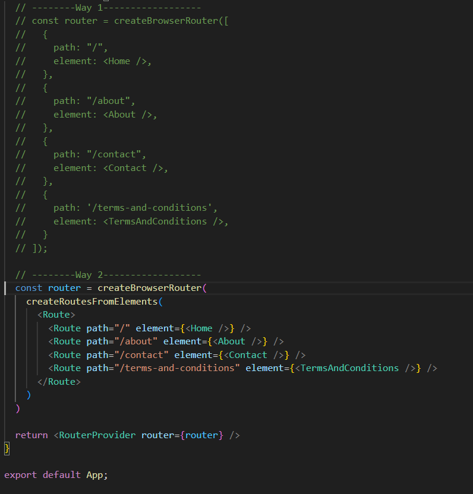
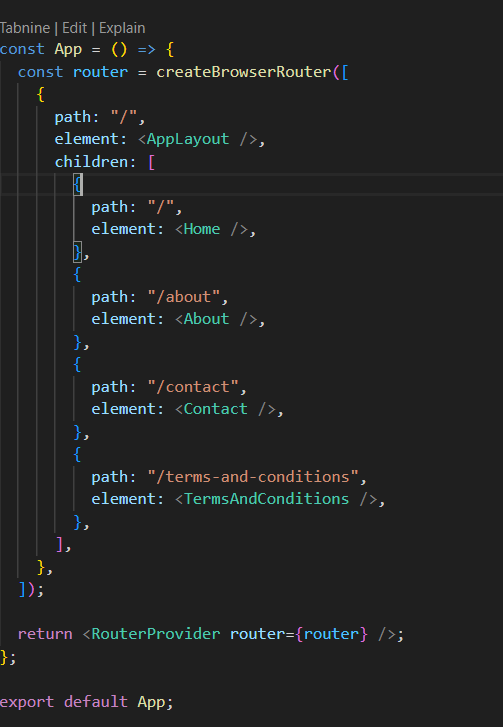

# REACT ROUTER v6
- Install using the following command
npm install react-router --force ( if you are using react v19 or higher )

- Learn about Routes, 2 ways of defining routes. First is with createBrowserRoutes([{},{},{}]) containing the routes or using the createRoutesFromElements(<> <Route path="" element={}> <>) 

- Using AppLayout and Outlet.

- Outlet is the children that comes on the place of Outlet. The children is the one which comes under that route. like on home page, you will see the app layout will be there and instead of outlet the home page will be there.