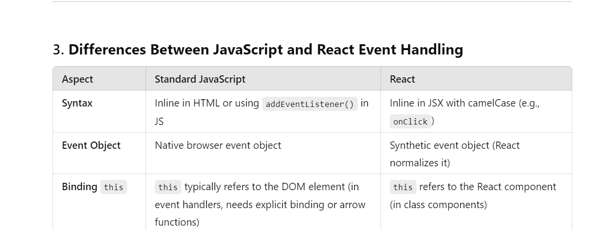

## Event Handling

- process of capturing and responding to user interactions such as clicks or form submissions, within a React appliction.

- Event Naming Convention : camelCase , prefix with 'on' like onClick, onChange and onSubmit.

- Function Naming Convention : same camelCase , prefix with 'handle' to clearly indicates their purpose. For Example handleButtonClick, handleInputValue Change and handleFormSubmit

- very similar process that we have seen in Standard Javascript event handling but with some key differences such as here we are using <u>Synthetic Events</u> for cross-browser compatibility and providing consistent event handling across different elements and browser.
  In Javascript we get an Event Object instead of Synthetic Event Object

#### SyntheticBaseEvent In React

- when you handle events in react, like clicking a button or typing in an input field, we call that events "SyntheticBaseEvent" in React.
- Its Basically a wrapper around the browser's native event, that make sure that events behave consistent around browsers.
- Some Widely used React.js events :
  - onClick : Triggered when an element is clicked.
  - onChange : Triggered when the value of an input element changes.
  - onSubmit : Triggered when a form is submitted.
  - onMouseEnter : Triggered when the mouse pointer enters an element.
  - onMouseLeave : Triggered when the mouse pointer leaves an element.
  - onKeyDown : Triggered when a key is pressed down.
  - onKeyUp : Triggered when a key is released.
  - onFocus : Triggered when an element receives focus.
  - onBlur : Triggered when an element loses focus.
  - onInput : Triggered when the value of an input element is changed (similar to onChange)

## Some Important Terms :

- Event Propagation : refers to the process of how events travels or propagate through the DOM hierarchy. In JS there are two phases of it : capturing ( starts from top or the root of the DOM and goes down to the target element ) and bubbling phase ( opp of capturing phase ).

  - In React, by default is bubbling phase.
  - Bubble : When you click the button, the event first triggers the button's event listener.
    Then, it bubbles up to the parent div, and the div's event listener is triggered.
  - Capture : When you click the button, the event does not start with the button's listener. Instead, it starts at the top (parent div) because we used { capture: true } to listen in the Capturing Phase.
    The event goes down to the parent div first, and then to the button.

    <code> document.getElementById('parent').
    addEventListener('click',
    function() {
    alert('Parent clicked (Capturing phase)');
    }
    , { capture: true }
    );
    </code>

- Event Delegation: Attach a single listener to a parent element and handle events for all child elements.
