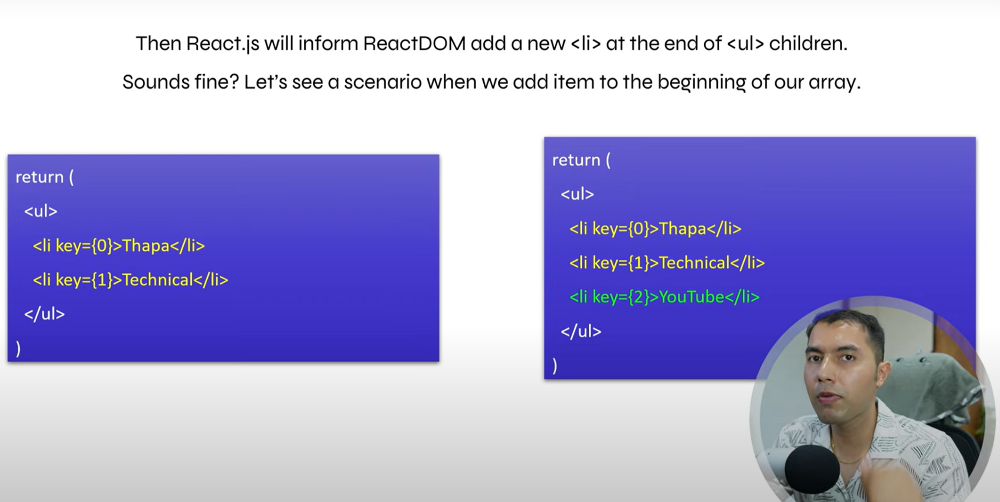
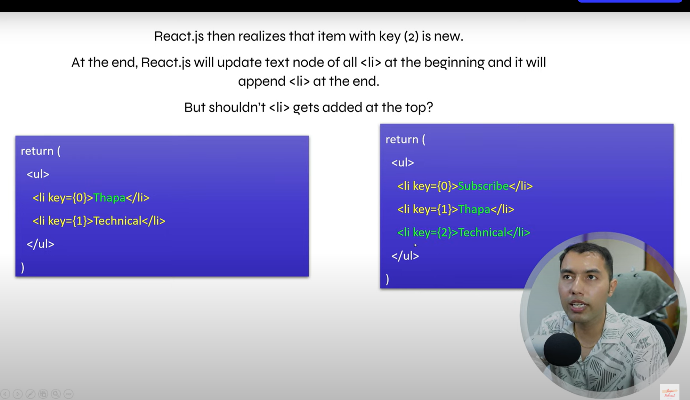
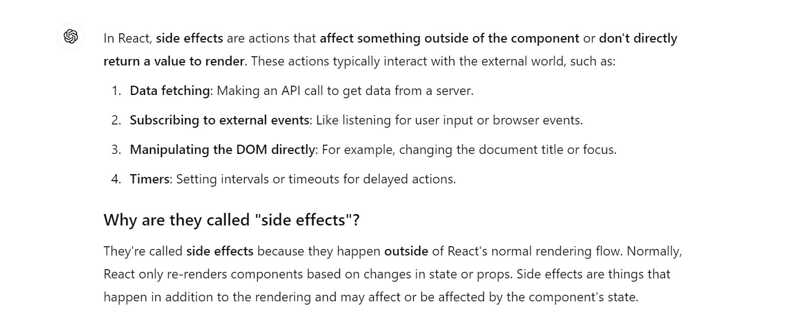
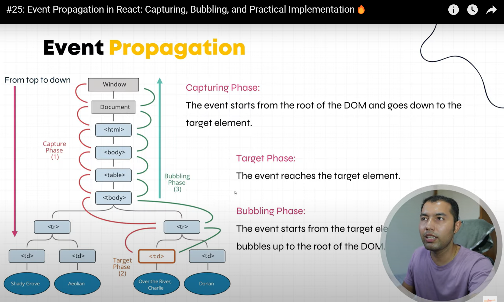
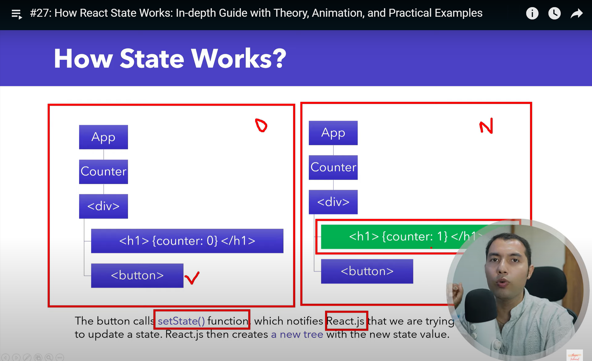
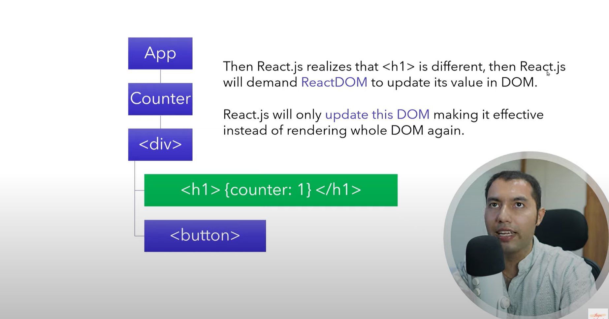
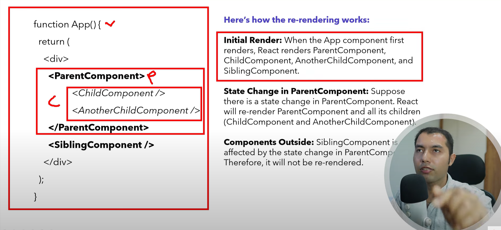
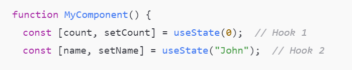
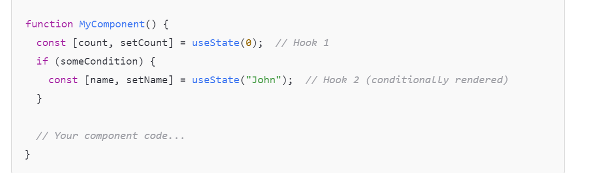

## Keys Are Important

- a string or a number that uniquely identifies it among other items in that array.
- Keys tell React which array item each component corresponds to, so that it can match them up later. This is because important if the array items can move (eg. due to sorting) , get inserted or deleted. 
- React will perform reconciliation to differentiate which item has been updated or changed or been added or removed.
- Rules are simple -> Keys must be unique and must not be changed
- When we add the new item in the last 

- when we add the item in the beginning of the array :  instead of entering the array index as an key, make sure the key doesn't change because in our case index is not sure to differentiate the elements

## Event Handling

- process of capturing and responding to user interactions such as clicks or form submissions, within a React appliction.

- Event Naming Convention : camelCase , prefix with 'on' like onClick, onChange and onSubmit.

- Function Naming Convention : same camelCase , prefix with 'handle' to clearly indicates their purpose. For Example handleButtonClick, handleInputValue Change and handleFormSubmit

- very similar process that we have seen in Standard Javascript event handling but with some key differences such as here we are using <u>Synthetic Events</u> for cross-browser compatibility and providing consistent event handling across different elements and browser.
  In Javascript we get an Event Object instead of Synthetic Event Object

## SyntheticBaseEvent In React

- when you handle events in react, like clicking a button or typing in an input field, we call that events "SyntheticBaseEvent" in React.
- Its Basically a wrapper around the browser's native event, that make sure that events behave consistent around browsers.
- Some Widely used React.js events :
  - onClick : Triggered when an element is clicked.
  - onChange : Triggered when the value of an input element changes.
  - onSubmit : Triggered when a form is submitted.
  - onMouseEnter : Triggered when the mouse pointer enters an element.
  - onMouseLeave : Triggered when the mouse pointer leaves an element.
  - onKeyDown : Triggered when a key is pressed down.
  - onKeyUp : Triggered when a key is released.
  - onFocus : Triggered when an element receives focus.
  - onBlur : Triggered when an element loses focus.
  - onInput : Triggered when the value of an input element is changed (similar to onChange)

## Some Important Terms :

- Side Effects : changes or interactions that occur outside of the scope of the function or block of code.

- Event Propagation : refers to the process of how events travels or propagate through the DOM hierarchy. In JS there are two phases of it : capturing ( starts from top or the root of the DOM and goes down to the target element ) and bubbling phase ( opp of capturing phase ).

  - In React, by default is bubbling phase.
  - Bubble : When you click the button, the event first triggers the button's event listener.
    Then, it bubbles up to the parent div, and the div's event listener is triggered.
  - Capture : When you click the button, the event does not start with the button's listener. Instead, it starts at the top (parent div) because we used { capture: true } to listen in the Capturing Phase.
    The event goes down to the parent div first, and then to the button.

    <code> document.getElementById('parent').
    addEventListener('click',
    function() {
    alert('Parent clicked (Capturing phase)');
    }
    , { capture: true }
    );
    </code>

  

- Event Delegation: Attach a single listener to a parent element and handle events for all child elements.

- Reconciliation : The Virtual DOM is a programming concept where an virtual representation of the UI is kept in memory and synced with the "real" DOM by a library such as ReactDOM. This process is called reconciliation.  (OR) the process through which React updates the DOM.

  - Diffing Algorithm : Diffing short for Differences Algorithm. and is used to differentiate the DOM Tree for effecient updates. 

  
  

  One thing to remember is that when react creates a new DOM tree, it will re-run or re-render the affected component and all its children. It will not re-render other components.

  
 
 
  
 

# Hooks
- Let you use different react features from your components.
- It starts with use_ _ _ _ _   like useEffect, useState, etc. 

## Rules
- It can only be used at the top level of your component.
- Don't call hooks inside loops, conditions or nested functions.
- Call hooks only from React function components or custom Hooks. Don't call hooks from regular javascript functions or in Class components.
- You can create custom hooks by creating functions starting with use keyword and this will ensure that React can identify it as a Hook (ex : useFetch, useForm)
- Hooks are called in the same order. React assigns a unique identifier to each hook during the initial render. This identifier is based on the order of the hooks in the code.
like 
and you tried this 
In this case, when the component re-renders, React will try to match the hooks in the order they are called. If someCondition is false, the useState("John") hook won't be called, and the internal hook list will not match up with what React expects, causing errors.

## 1. useState in React JS

- In React, state refers to an object that holds data or information about the component. State is managed within the component (just like the variables declared in function). However, state changes make the component re-render so that the UI is synchronized with the the state.

- State is dynamic and mutable. When the state changes, React responds to it and update the DOM based on that. We have useState hook to update the state.

- This type of function which starts with "use" is called hook.

- this is a special function which has some features provided by react.js

- Always use useState cleanup function to clear intervals else it will create a memory leak because after every time the state will change and the component will be re-rendered again and again.

- It tooks some time to change the state so if you change the value and then immediately try to console the state, you will get the old state value.

### Derived state :
-  any state that can be computed based on the other state or props. It is not stored directly in the component's state but is calculated when needed.
This approach helps avoid duplication and keeps the state simpler and more manageable.
 Ex : const userCount = users.length;

### Lifting up the State : 
- a pattern in react where you move the state from child components to a common parent component so that multiple child components can share the same state. Not only values by the events handlers as well so that child components cna update the state as well and parent state value can be updated by child.
- Important when multiple sibling components need the same state, you can simiply lift the state to their nearest common parent component. You want this because you can't share the same state between sibling components. it can only be shared from parent to child (one-direction flow from top to bottom and not side to side)
